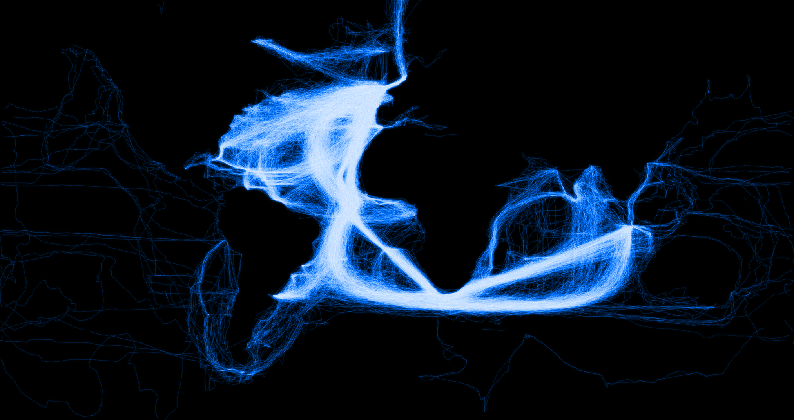

# Brief

_Bound Lines_ is a digital print that visualizes 18th century ship logs and reveals the "footprints" of sailors as they explored the world.

# Motivation

We began with the question of whether the data from historic ships' logs could be used as a drawing tool. Much like the exercise of drafting negative space rather than the object itself, we have decided to create images of the world by following the travels of early sailors as they traced their way around the globe - gradually feeling out the forms of our continents. Each individual thread represents the travels of an individual European ship from the 18th or 19th century. The visuals are generated computational from the [CLIWOC](http://pendientedemigracion.ucm.es/info/cliwoc/) dataset.

# Sources

- [Climatological Database for the World's Oceans 1750-1850](http://pendientedemigracion.ucm.es/info/cliwoc/)
- [Code repository](https://github.com/mikewesthad/ship-climate-data)
