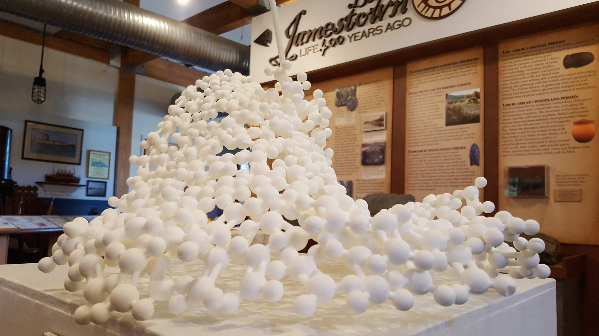
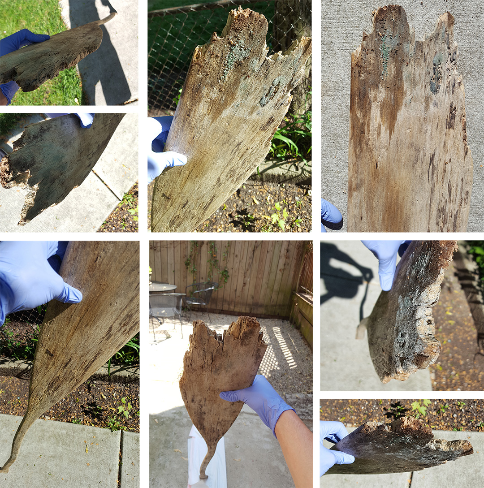
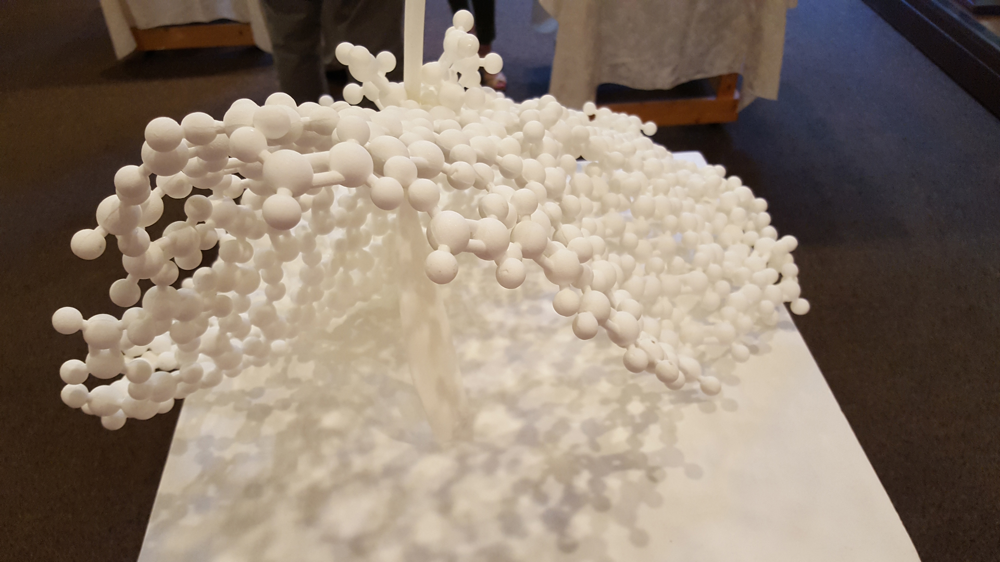
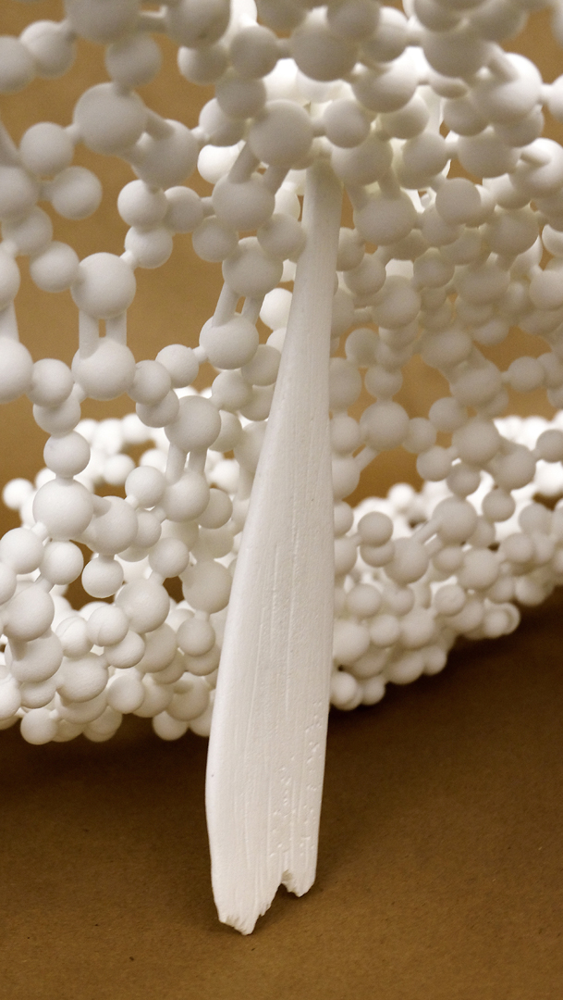
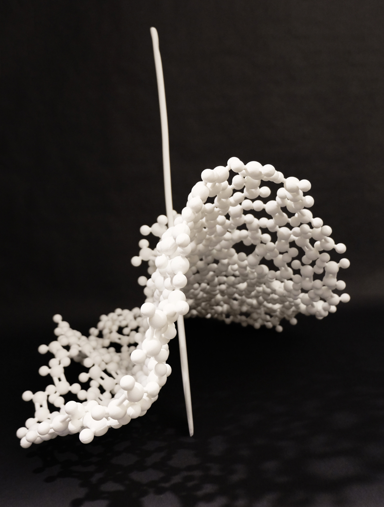
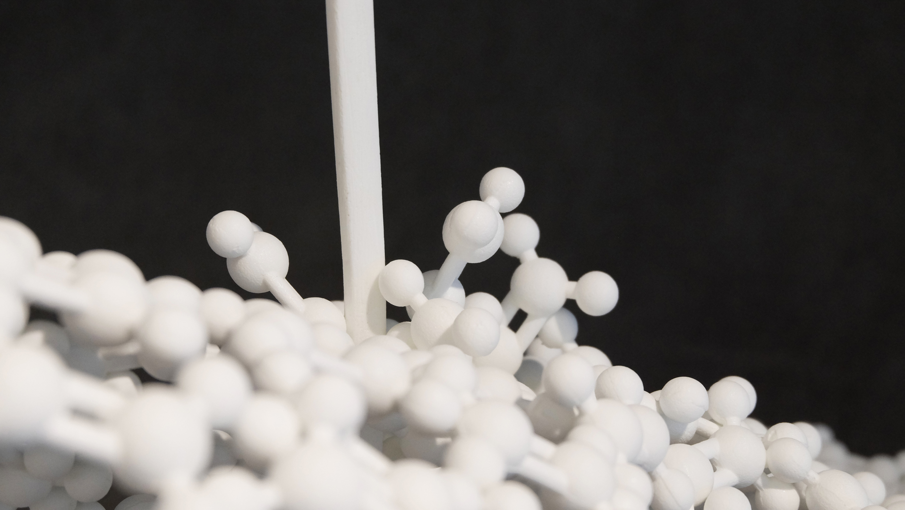

# Brief

For the “Oars for Art” show in Maryland, we took an abandoned and decaying paddle from The Havre de Grace Maritime Museum’s collection, and through a process of photography, 3D modeling, 3D printing and traditional mold-making, transformed it into a sculpture where a miniaturized paddle intersects a flowing wave of magnified ethylene plastic molecules. The decay of the paddle stands in stark contrast to the durable plastics that we use in everyday life and that have been showing up in our water and waterways.

# Full Statement

The decay of the wooden paddle selected for this piece stands in striking contrast to the durable plastics that we use in everyday life and that have been showing up in our water and waterways. Inspired by the paddle’s curves and degradation, we digitized it through photography and 3D modeling, freezing the decaying form into a sculptural snapshot. Through 3D printing and traditional mold-making, we created and assembled replicas of the paddle and ethylene molecules - the building block of many plastics.

The miniaturized paddle intersects a flowing wave of magnified plastic molecules, echoing the shape of turbulence produced as a paddle cuts through water. The shadows cast by the plastic molecules mirror caustics - the way sunlight is bent and concentrated as it passes through the curved surface of water. Despite being entirely composed of man-made plastics, the sculpture echoes the natural world.
