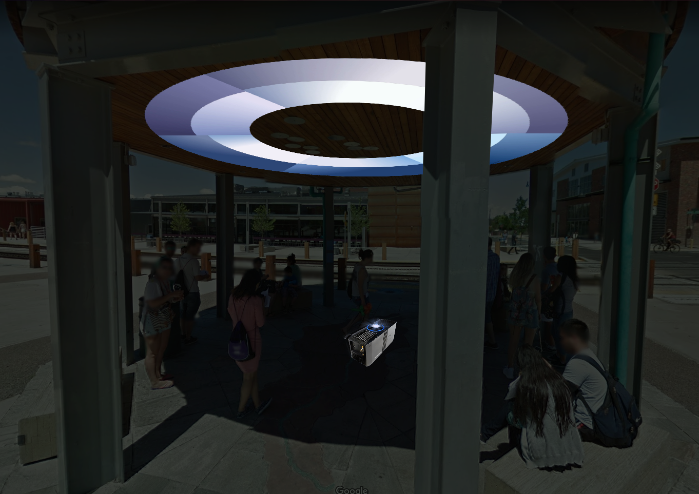
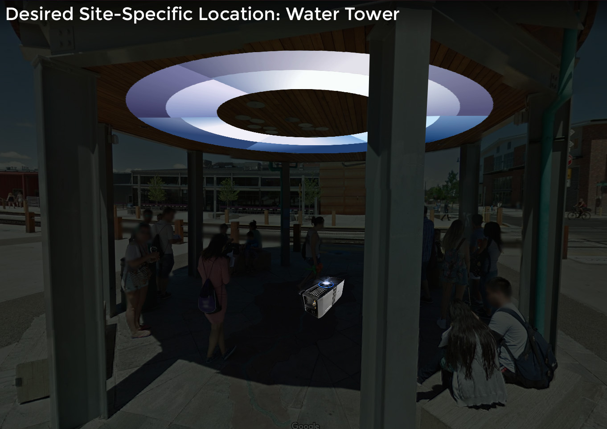
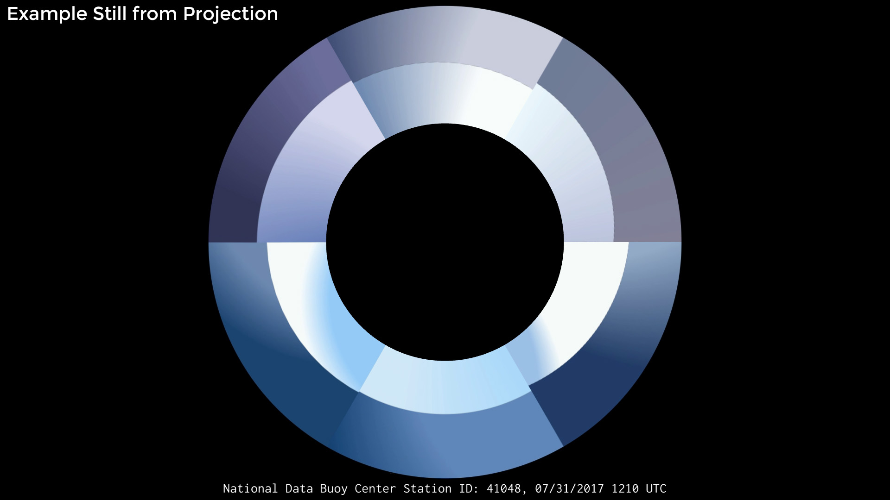
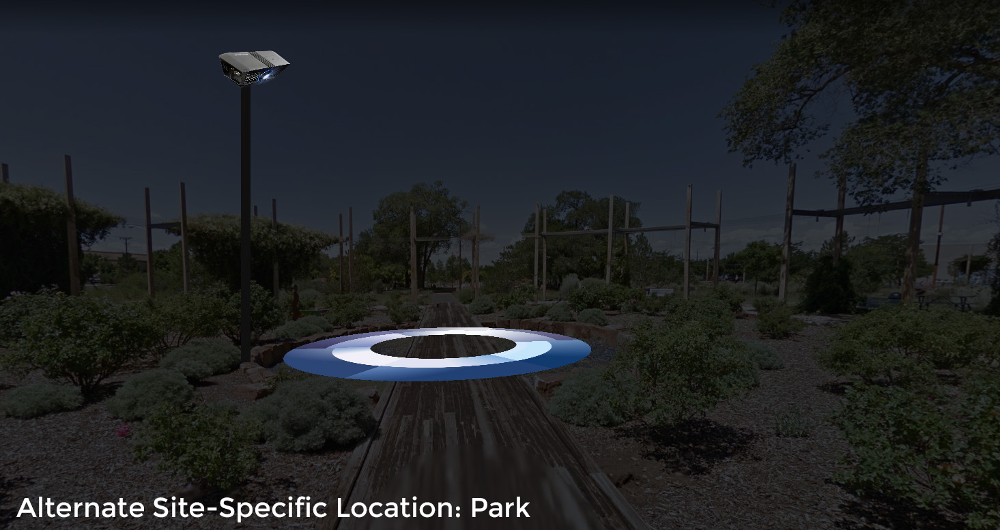
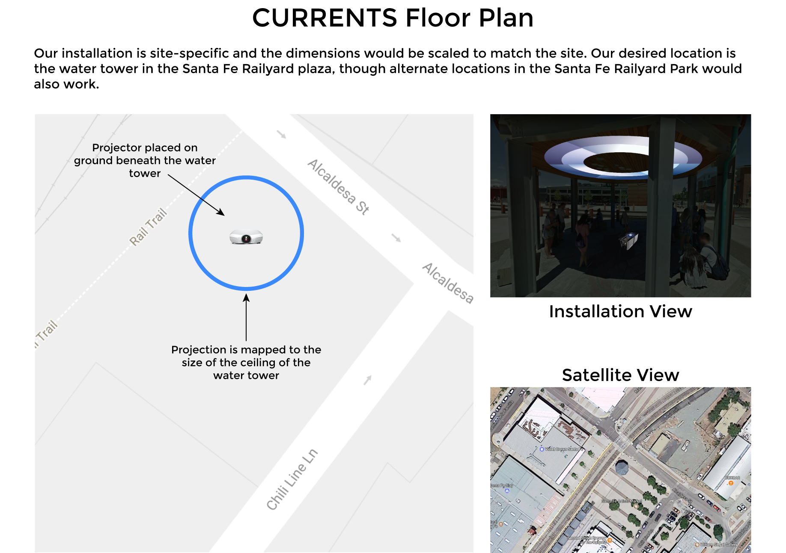

# Endless Horizons: Images for Machine Learning & Leisure, 2017

## Concept

While scraping panoramic images of the US coast from the NDBC’s network of camera-enabled buoys, we wondered how a computer might interpret or “see” these many beautiful, and at times tumultuous, vistas of virtually endless sea and sky. Using computer vision, each panorama has been computationally “reduced” to a series of simple color gradients and lines. The panoramic photos are only taken once per hour, so the video piece fills in and smooths the gaps of the undocumented passage of time. The panoramic views have then been individually wrapped into circular forms to fit the projection space of the underside of the Santa Fe Railyard Plaza water tower. Looking upward, the viewer is immersed in a large-scale circumference of fluctuating sea and sky, and left to question the relationship between fresh water, the desert landscape and shifting sea levels. 

## Logistics

The work is a site-specific installation featuring a single channel video. The desired location is the Santa Fe Railyard Plaza water tower. We would place a secured projector on the ground pointed at the ceiling of the public space under the water tower. The projection will be driven by a lower power micro-computer (Raspberry PI). If the water tower is not a feasible location, there are alternate sites in the Santa Fe Railyard park that would work well (see proposal sketch).

If there is a power supply in the water tower, we would run an extension cable - with a cord cover - to the projector and micro-computer. Alternatively, we would place a portable power station next to the projector.

The projector and micro-computer would be placed within a projector enclosure and locked to a nearby structure (e.g. a leg of the water tower).

The minimum number of artists required to travel is two.

## CV

[Resume](/encoded-objects-resume.pdf)

## Images of Proposed Work

Desired location:

Still from the projection:

Excerpt from the projection:

<iframe src="https://player.vimeo.com/video/241415103" width="640" height="360" frameborder="0" webkitallowfullscreen mozallowfullscreen allowfullscreen></iframe>

Alternate location:

## Floor Plan

## Supplies

**Equipment from Festival**

- A short throw projector (5000 lumens or greater)
- Power supply 
- Lock
- Projector enclosure

**Equipment from Us**

- Micro-computer (Raspberry PI)
- HDMI Cable
- Extension cord
- Power strip
