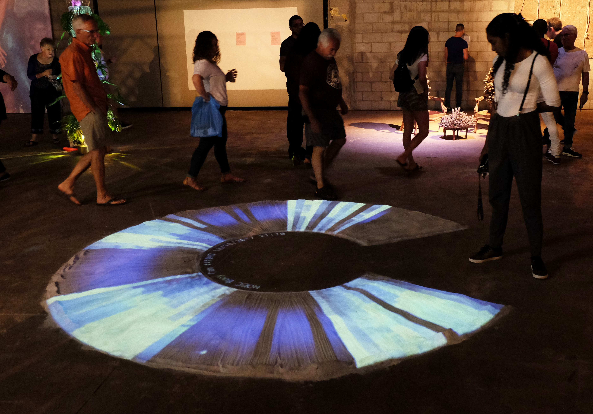
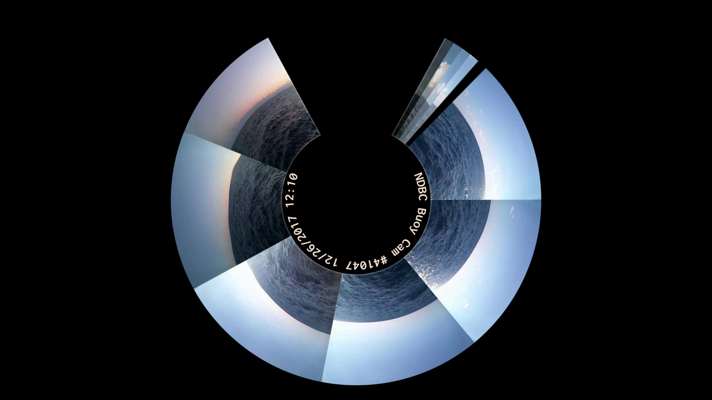
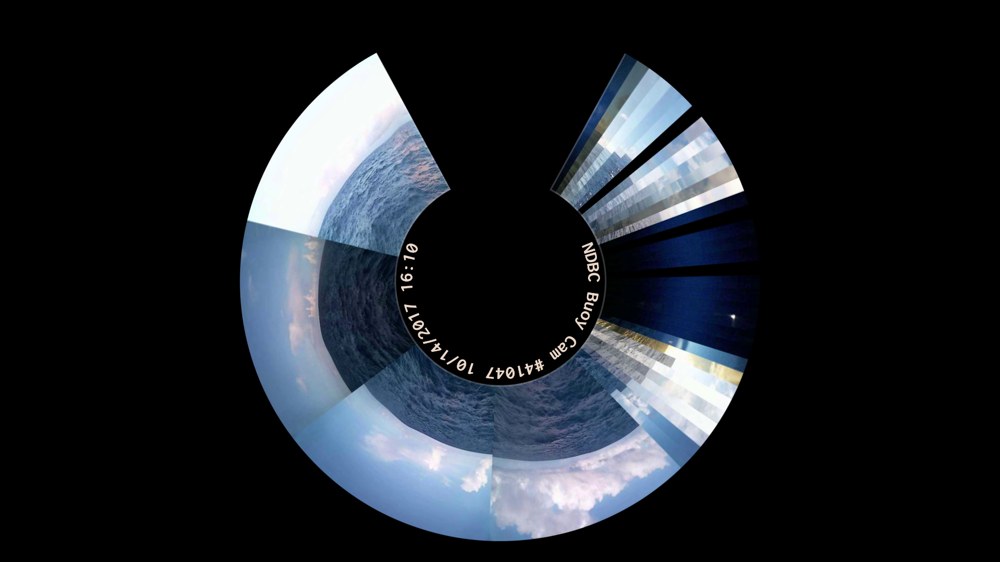
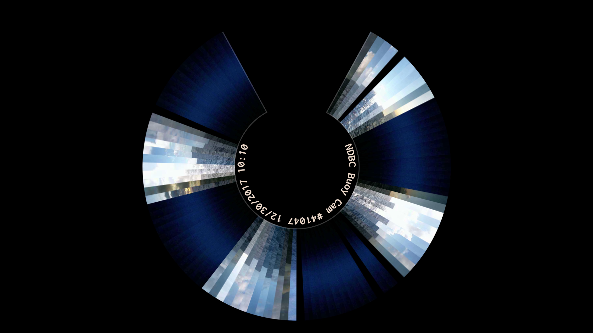
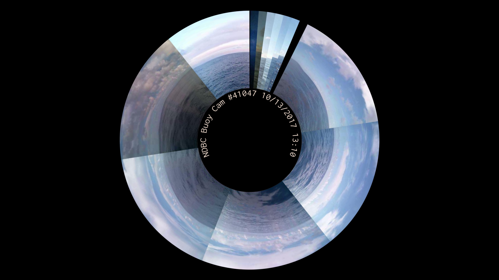
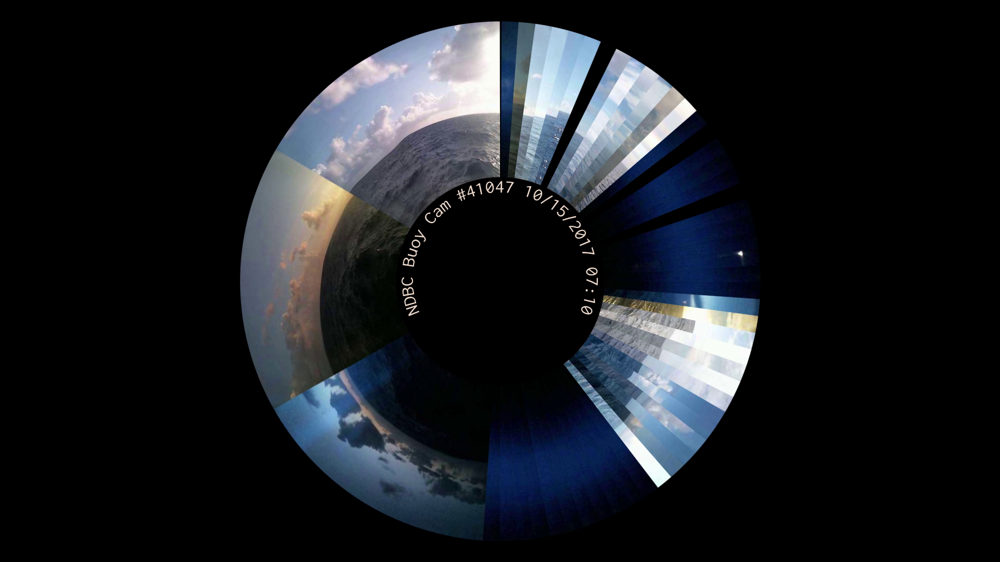

# Brief

Due east of South Florida, NOAA’s data buoy #41047 records hourly measurements of weather and water conditions while taking solitary panoramic photos of the Atlantic Ocean. These staccato snapshots of the buoy’s world seem so distant from our own landlocked lives, yet the two are intimately linked. _Endless Horizons_ invites the viewer to step into 41047’s world and become circumscribed by fluctuating sea and sky. The history of 41047 plays back over the course of minutes, quietly questioning the notions of time, permanence & impermanence, and Florida’s precarious relationship with the ocean.

<iframe src="https://player.vimeo.com/video/267351350" width="640" height="360" frameborder="0" webkitallowfullscreen mozallowfullscreen allowfullscreen></iframe>

# Hot and Sticky, 2018

_Endless Horizons_ was shown in the _Hot & Sticky: The Sultry State_ exhibition at the Projects of FATVillage in Fort Lauderdale, FL. In this iteration of the piece, the video was projected onto a 10 foot diameter ring of sand on the ground. Visitors could step inside of the ring.

Stills from the projection:

# Plexus Projects, 2018

_Endless Horizons_ was also shown as a single-channel video installation in the [_Future Artifact_](http://www.plexusprojects.org/programming/2018-future-artifact-creative-tech-week) exhibition at Plexus Projects in Brooklyn, NY.

Stills from the video:

# Sources

- [The National Buoy Data Center](http://www.ndbc.noaa.gov/buoycams.shtml)
