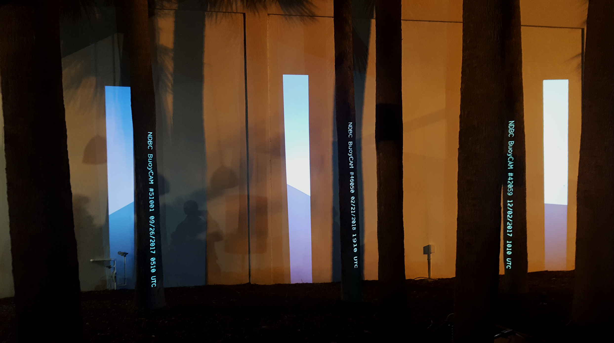

# Brief

_Shades: Captured Horizons_ is a site-specific mapping video installation.

# Outside the Box

Digital excerpt of the video mapping composition:

<iframe src="https://player.vimeo.com/video/259802722" width="640" height="360" frameborder="0" webkitallowfullscreen mozallowfullscreen allowfullscreen></iframe>

# Sources

- [The National Buoy Data Center](http://www.ndbc.noaa.gov/buoycams)
