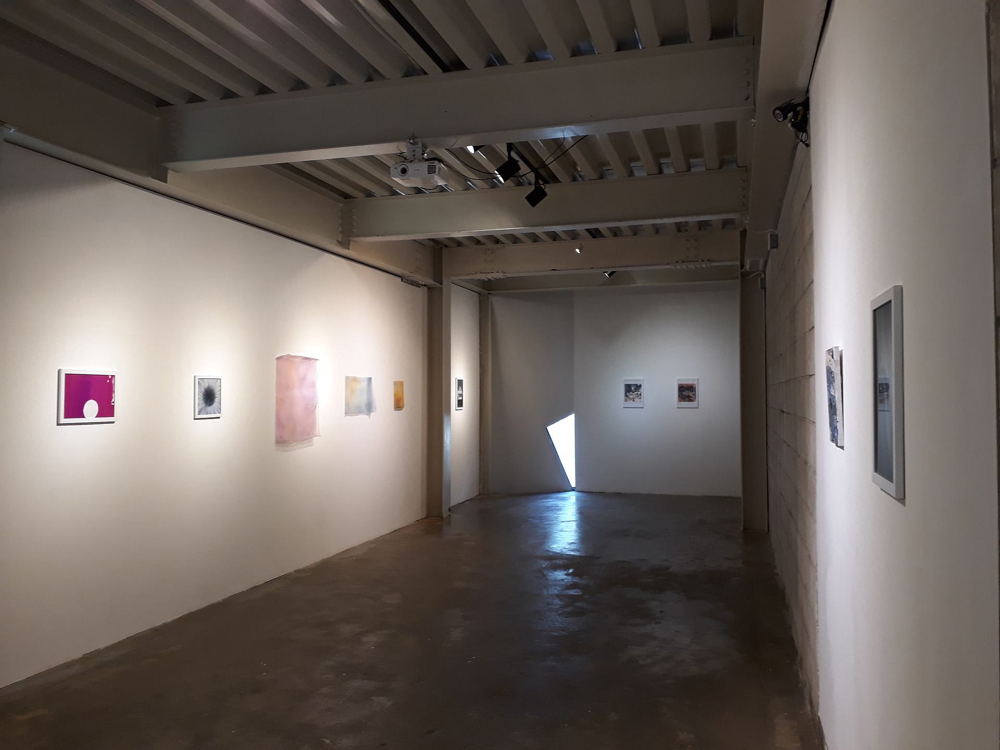

# Brief

Included in the “Color 2018” show at the CICA Museum in South Korea, this time-lapse digital print represents the history of NOAA’s buoy #41424 as it became unmoored from its home on the East Coast in 2017 and drifted across the ocean to Iceland. Each sliver of color in the print represents one hour from the last two months before 41424 finally went offline.

# Sources

- [The National Buoy Data Center](http://www.ndbc.noaa.gov/buoycams.shtml)
